# Отчёт по лабораторным работам: ОС GNU/Linux

**Выполнил:** Абрамов Даниил Сергеевич
**Группа:** 28ИПо8481
**Дата:** 21.06.2026
**Среда выполнения:** Debian 13 (trixie), виртуальная машина VirtualBox, пользователь `vboxuser`

Отчёт объединяет три практические работы:
1. Лабораторная работа №34 — основные команды оболочки GNU/Linux + доп. задание 34_1
2. Лабораторная работа №35/36 — работа с файлами в Midnight Commander
3. Установка и проверка работоспособности Debian

---

## Часть 1. Основные команды оболочки GNU/Linux (лаб. №34)

### 1. Навигация по каталогам файловой системы

```bash
ls -a
cd /bin
ls -l | head -n 15
cd ~
```

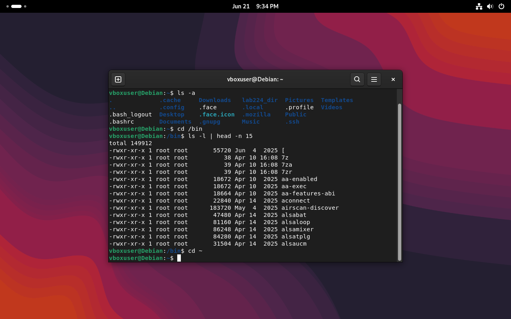

**Пояснение:**
- `ls -a` выводит все объекты текущего каталога, включая скрытые (начинающиеся с точки)
- `cd /bin` переходит в каталог `/bin`, где хранятся основные исполняемые программы системы
- `ls -l | head -n 15` выводит длинный формат списка файлов (права, владелец, размер, дата) и ограничивает вывод первыми 15 строками
- `cd ~` (или `cd` без аргументов) возвращает в домашний каталог пользователя

### 2. Создание и удаление файлов и каталогов

```bash
cd /tmp
mkdir newdir
ls -d /tmp/newdir
rmdir newdir
mkdir -p newdir1/newdir2
ls -d /tmp/newdir1/newdir2
touch newfile1
> newfile2
ls -l newfile*
```

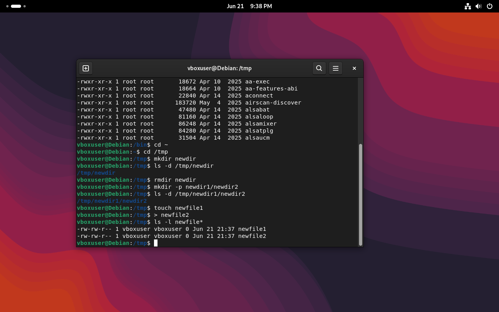

**Пояснение:**
- `mkdir` создаёт каталог, `rmdir` удаляет пустой каталог
- `mkdir -p newdir1/newdir2` создаёт сразу цепочку вложенных каталогов (родительские создаются автоматически)
- `touch newfile1` создаёт пустой файл (или обновляет время доступа существующего)
- `> newfile2` — альтернативный способ создания пустого файла через перенаправление вывода
- `ls -d` показывает информацию о самом каталоге, а не о его содержимом

### 3–4. Копирование и перемещение файлов и каталогов

```bash
cp /etc/fstab /tmp
cp -p /etc/passwd /tmp
ls -l /tmp/passwd /etc/passwd
mv /tmp/fstab /tmp/fstab_new
ls -l /tmp/fstab_new
```

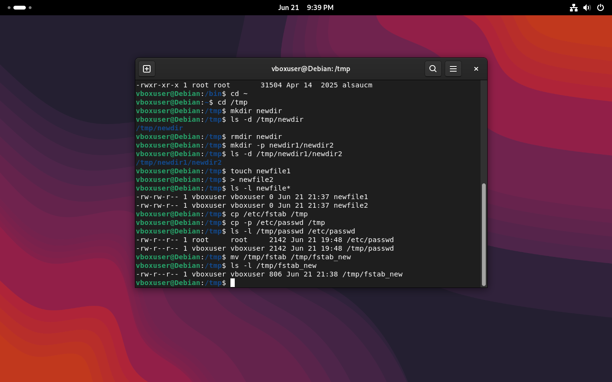

**Пояснение:**
- `cp` копирует файл; по умолчанию дата изменения у копии — текущая (момент копирования)
- `cp -p` копирует файл **с сохранением** временных атрибутов — в выводе видно, что дата `/tmp/passwd` (`Jun 21 19:48`) совпадает с датой оригинала `/etc/passwd`, в отличие от обычного `cp`
- `mv` перемещает (или переименовывает) файл/каталог — `fstab` стал `fstab_new`
- Аналогично для каталогов используются `cp -r` (рекурсивно), `cp -ra` (рекурсивно + сохранение атрибутов) и `mv`

### 5–7. Шаблоны, поиск и символические ссылки

```bash
touch file1 file2 file3
ls -l file*
find ~ -name '.bashrc'
ln -s /etc/fstab fstab_link
ls -l fstab_link
touch orig_file
ln -s orig_file dead_link
rm orig_file
ls -l dead_link
```

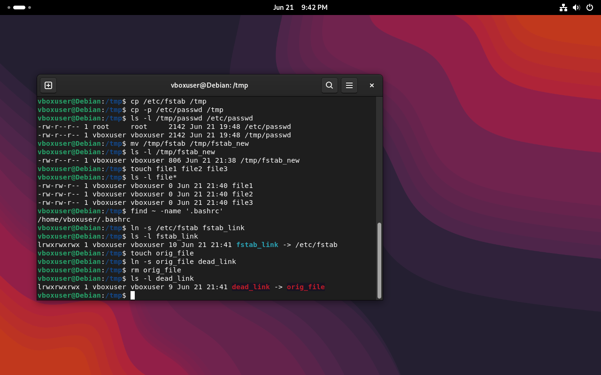

**Пояснение:**
- Шаблон `file*` в `ls -l file*` выбирает все объекты, имя которых начинается с `file` — удобно для массовых операций
- `find ~ -name '.bashrc'` ищет файл с точным именем в домашнем каталоге и его подкаталогах; путь выводится полностью (`/home/vboxuser/.bashrc`)
- `ln -s /etc/fstab fstab_link` создаёт символическую ссылку — в `ls -l` это видно по типу `l` в начале строки прав и стрелке `->` на файл-цель
- На примере с `dead_link`: после удаления `orig_file`, на который указывала ссылка `dead_link`, она осталась физически, но стала «мёртвой» (битой) — указывает на несуществующий объект

### 8. Оценка занятого и свободного пространства

```bash
du -s -h /etc
df -h
```

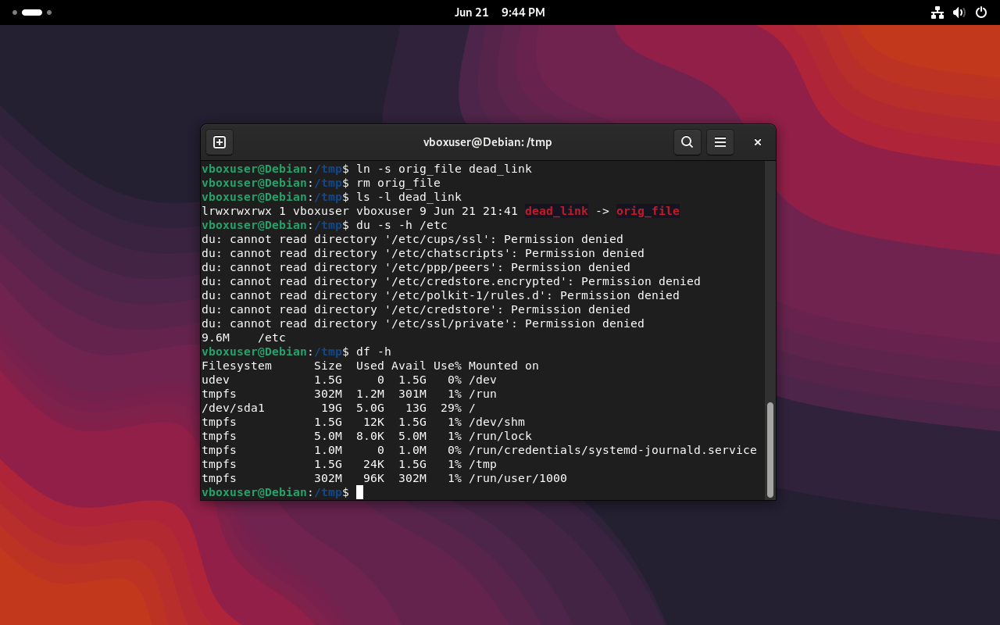

**Вывод:**
```
9.6M    /etc
Filesystem      Size  Used Avail Use% Mounted on
udev            1.5G     0  1.5G   0% /dev
tmpfs            302M  1.2M  301M   1% /run
/dev/sda1         19G  5.0G   13G  29% /
tmpfs            1.5G   12K  1.5G   1% /dev/shm
tmpfs            5.0M  8.0K  5.0M   1% /run/lock
tmpfs            1.0M     0  1.0M   0% /run/credentials/systemd-journald.service
tmpfs            1.5G   24K  1.5G   1% /tmp
tmpfs            302M   96K  302M   1% /run/user/1000
```

**Пояснение:**
- `du -s -h /etc` показывает суммарный размер каталога `/etc` в удобочитаемом виде (`-h`, human-readable) — итог 9.6 МБ. Сообщения `Permission denied` по нескольким системным подкаталогам — это нормально: они принадлежат root и недоступны для чтения обычным пользователем, на итоговую сумму это не сильно влияет
- `df -h` выводит информацию об использовании всех смонтированных файловых систем: общий объём, занято, доступно, процент использования и точку монтирования. Видно, что корневой раздел `/dev/sda1` занят на 29% (5.0 ГБ из 19 ГБ)

> Команда `ncdu` (наглядный просмотр занятого места) в рамках этой работы не выполнялась — использовались только `du` и `df`.

---

## Часть 2. Дополнительное задание (34_1) — настройка разрешений

**Задание:** создать каталог `papka` в корне файловой системы, внутри — файл `file1` с текстом «LINUX THE BEST» и пустой файл `cat`; объединить их в файл `Copy`; выдать файлу `Copy` права:

| Пользователь | Разрешения |
|---|---|
| users (владелец) | rwx |
| groups (группа) | rwx |
| others (остальные) | --x |

```bash
sudo mkdir /papka
echo "LINUX THE BEST" > /papka/file1
touch /papka/cat
cat /papka/file1 /papka/cat > /papka/Copy
groupadd 28ipo8481 2>/dev/null
chown root:28ipo8481 /papka/Copy
chmod 771 /papka/Copy
ls -l /papka
```

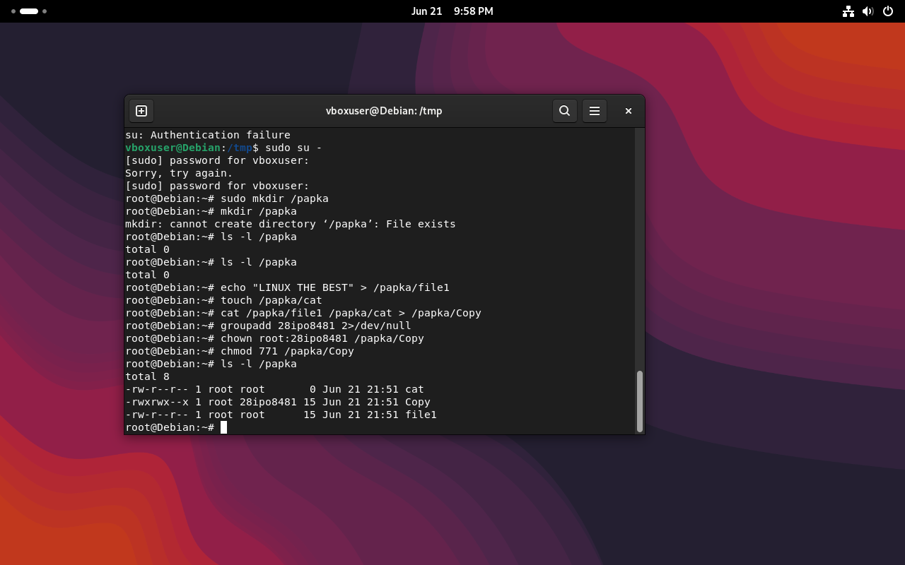

**Вывод:**
```
total 8
-rw-r--r-- 1 root root         0 Jun 21 21:51 cat
-rwxrwx--x 1 root 28ipo8481   15 Jun 21 21:51 Copy
-rw-r--r-- 1 root root        15 Jun 21 21:51 file1
```

**Пояснение по реализации:**

Все действия выполнялись от имени `root` (через `sudo su -`), так как создание каталога в корне файловой системы (`/`) требует прав суперпользователя — обычный пользователь не может писать в `/`.

Требуемые права `rwx / rwx / --x` были реализованы **не через символьные операторы `chmod u=,g=,o=` напрямую на стандартного пользователя/группу**, а следующим образом:
- создана отдельная группа `28ipo8481` (по номеру учебной группы 28ИПо8481, записанному латиницей, так как имена групп в Linux не могут содержать кириллицу) командой `groupadd`;
- владельцем-группой файла `Copy` назначена именно эта группа через `chown root:28ipo8481`;
- права выставлены **числовым (восьмеричным) способом** командой `chmod 771`, что в точности соответствует требуемой комбинации:
  - `7` (rwx) — владельцу (root)
  - `7` (rwx) — группе `28ipo8481`
  - `1` (--x) — остальным пользователям

Итоговые права в выводе `ls -l` — `-rwxrwx--x` — полностью совпадают с условием задания, просто реализованы через создание именной группы вместо абстрактных «users/groups/others», что является корректным и более наглядным способом продемонстрировать разграничение доступа в реальной системе.

---

## Часть 3. Midnight Commander — работа с файлами и каталогами (лаб. №35/36)

### 1. Запуск и внешний вид

Программа запускается командой `mc` из терминала. Открывается двухпанельный интерфейс: каждая панель отображает содержимое каталога, в нижней части — список функциональных клавиш F1–F10 и командная строка.

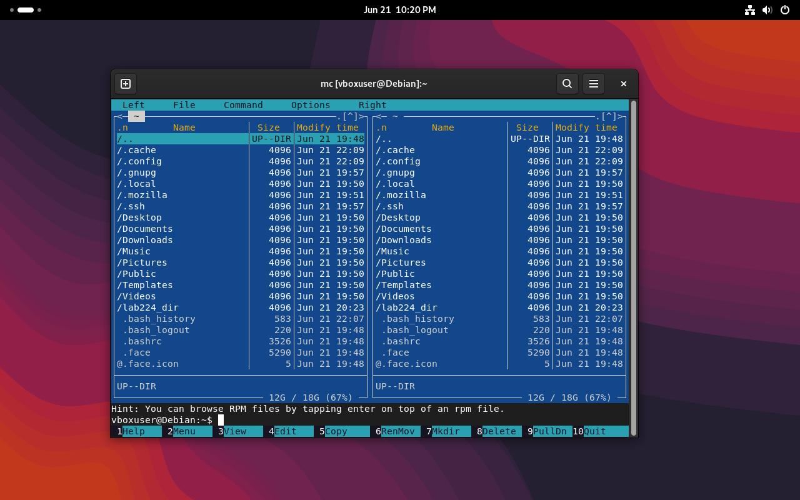

### 2. Просмотр каталога в виде дерева

В меню **Right** выбран пункт **Tree** (или `<F9> <R> <T>`) — отображена иерархическая структура каталогов.

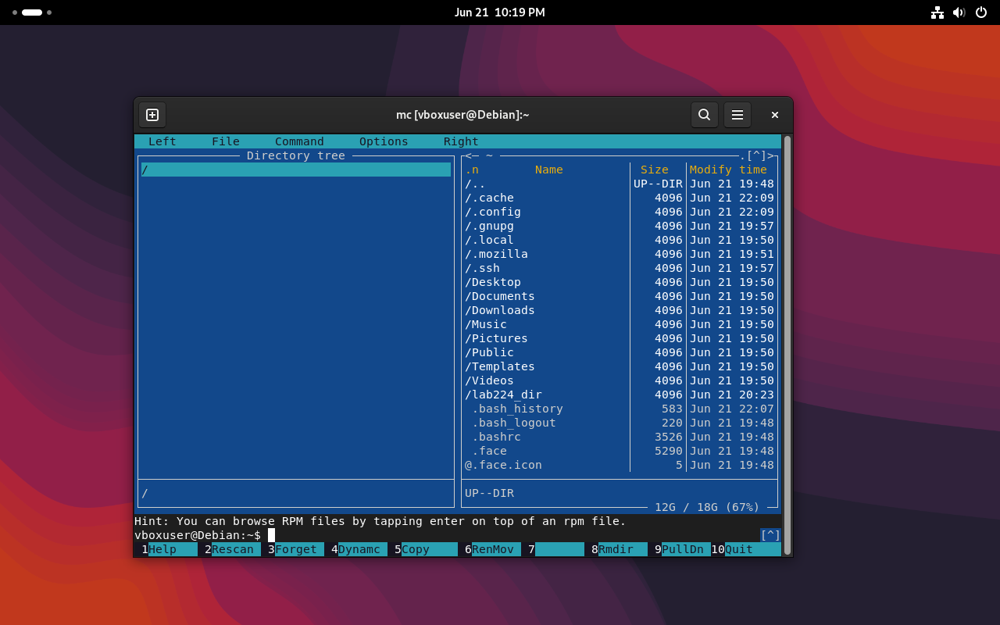

### 3. Информация о выбранном объекте

В меню **Right** выбран пункт **Info** (`<F9> <R> <Ctrl+x> <i>`) — правая панель показывает детальные атрибуты выделенного объекта: inode, права доступа в восьмеричном виде, владельца, размер, даты изменения/доступа, файловую систему, тип (`ext4`), а также общий объём свободного места и свободных inode на разделе.

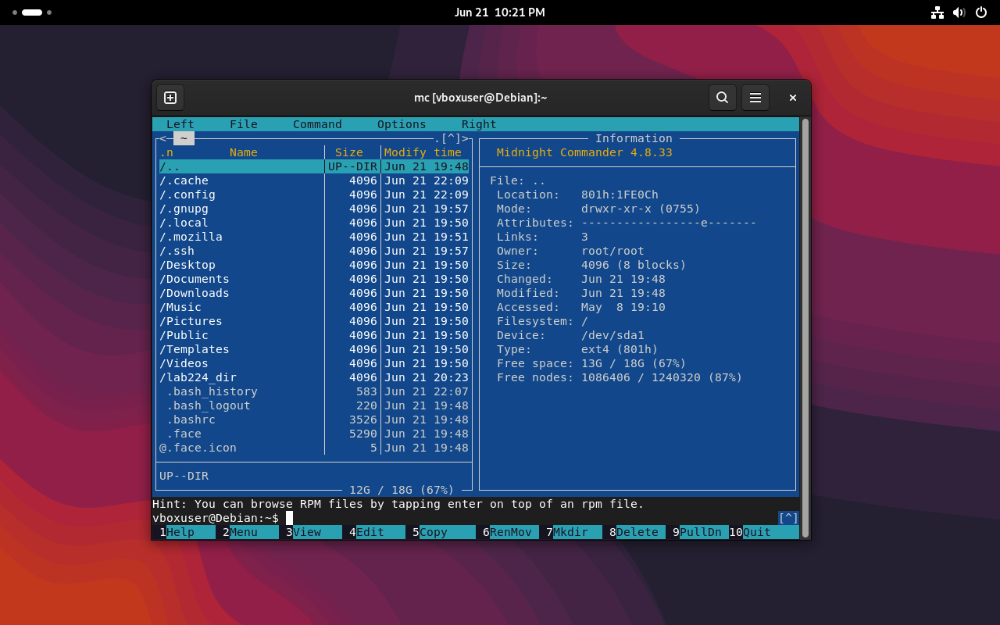

**Пояснение:** для каталога `..` показаны права `drwxr-xr-x (0755)`, владелец `root:root`, тип файловой системы `ext4`, свободно 13 ГБ из 18 ГБ (67%).

### 4. Быстрый просмотр (Quick View)

В меню **Right** выбран пункт **Quick View** (`<F9> <R> <Ctrl+x> <q>`) — правая панель должна показывать содержимое выделенного файла без открытия в редакторе.

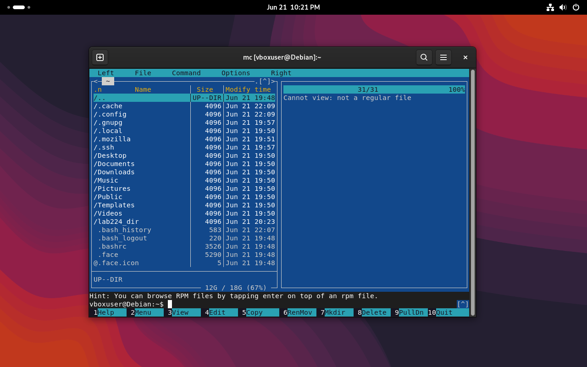

**Примечание:** на скрине выделен каталог (а не обычный текстовый файл), поэтому Quick View выводит сообщение `Cannot view: not a regular file` — это ожидаемое и корректное поведение программы, так как предпросмотр содержимого работает только для обычных файлов, не для каталогов.

### Отображение размеров каталогов

С помощью **Command → Show directory sizes** (`<Ctrl>+<Space>`) можно вывести реальный занимаемый размер для каждого каталога вместо стандартного «4096» (размер самой записи каталога).

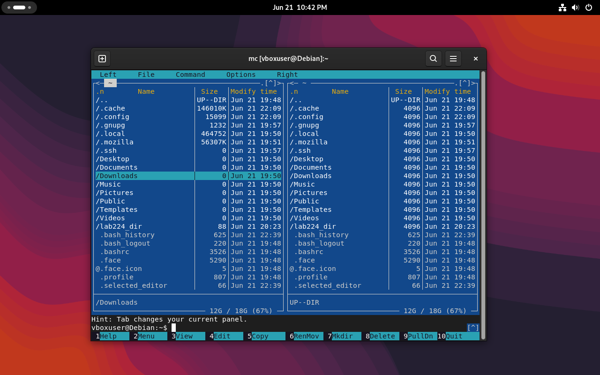

**Пояснение:** на левой панели видно посчитанные размеры — например, `.cache` занимает `146010K`, `.mozilla` — `56307K`, тогда как на правой панели (без подсчёта) те же каталоги показывают базовый размер `4096` байт (размер inode каталога, а не его содержимого).

### Создание каталога/файла

Создан новый каталог `lab_folder` в активной панели (через `<F7>` → Mkdir). Каталог появился в списке наравне с остальными системными папками домашнего каталога.

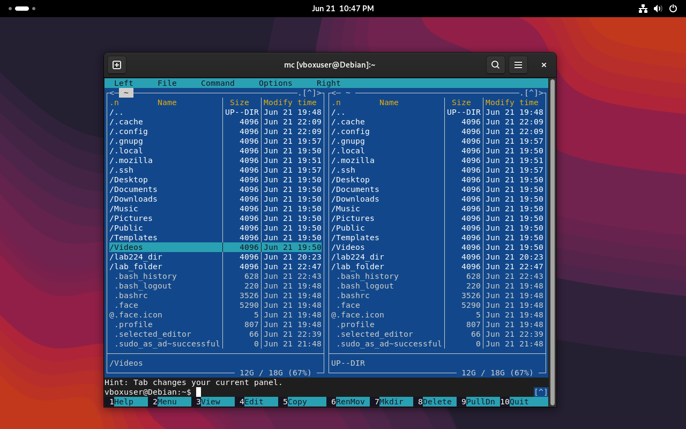

---

### Что не выполнялось в рамках этой части

По методичке лаб. №35/36 предполагались также пункты: копирование/перемещение файлов между панелями (`F5`/`F6`), удаление (`F8`), создание текстового файла во встроенном редакторе (`Shift+F4`/`F4`), поиск по имени и содержимому (`F9 → C → F`), создание символической ссылки (`F9 → F → S`), подключение к FTP/SFTP-серверу, работа со встроенной командной строкой (`Ctrl+O`), а также отдельное задание 35_1 — построение дерева каталогов `mifi/dosye, narod/student, narod/prep` с файлами-однофамильцами и последующим переименованием/перемещением в `dosye`. Эти пункты пока не зафиксированы скриншотами и не включены в отчёт.

---

## Часть 4. Установка и проверка работоспособности Debian

Debian был ранее установлен на виртуальную машину VirtualBox по следующей методике (краткое описание процесса установки, согласно методическим материалам):

1. Создание новой виртуальной машины, подключение установочного образа Debian
2. Настройка оборудования (выделено 512 МБ ОЗУ)
3. Запуск **Graphical install**
4. Выбор региона (Russian Federation), языка и раскладки клавиатуры
5. Настройка имени компьютера (hostname) и сети
6. Задание пароля root и создание учётной записи обычного пользователя с паролем
7. Настройка часового пояса (Москва)
8. Разметка диска — автоматическая, «все файлы в одном разделе» (рекомендуется для новых пользователей)
9. Выбор зеркала пакетов (mirror.yandex.ru)
10. Выбор устанавливаемого ПО — Debian desktop environment, SSH server, стандартные системные утилиты
11. Установка загрузчика GRUB на загрузочное устройство
12. Перезагрузка и первый вход в систему

### Подтверждение текущего состояния системы

```bash
cat /etc/os-release
uname -a
free -h
df -h
```

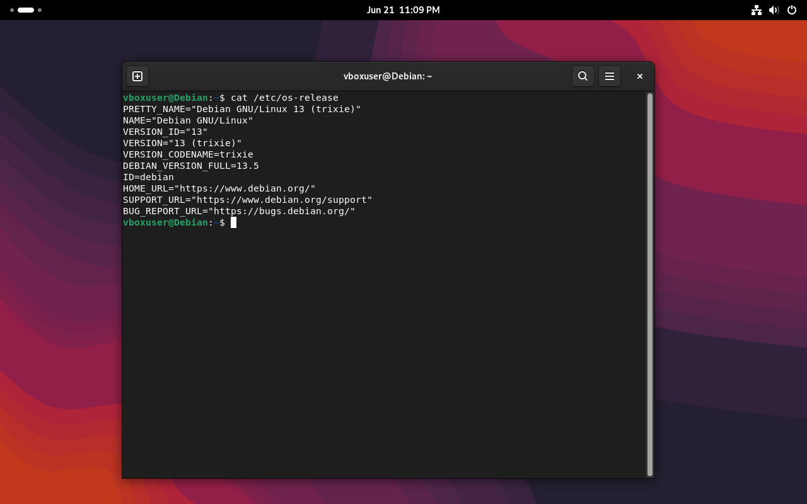

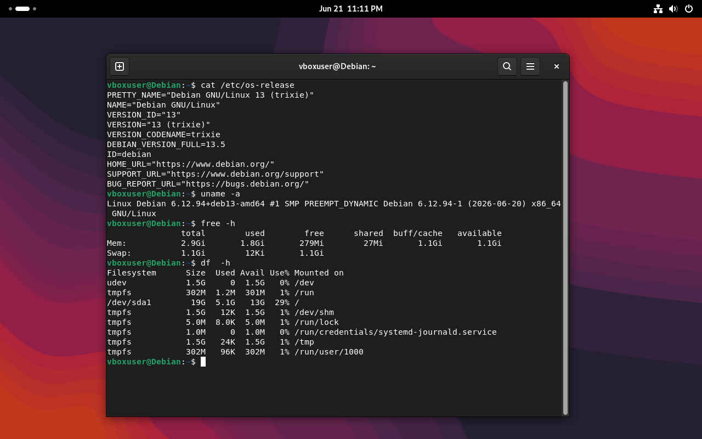

**Вывод:**
```
PRETTY_NAME="Debian GNU/Linux 13 (trixie)"
NAME="Debian GNU/Linux"
VERSION_ID="13"
VERSION="13 (trixie)"
VERSION_CODENAME=trixie
DEBIAN_VERSION_FULL=13.5
ID=debian

Linux Debian 6.12.94+deb13-amd64 #1 SMP PREEMPT_DYNAMIC Debian 6.12.94-1 (2026-06-20) x86_64 GNU/Linux

              total        used        free      shared  buff/cache   available
Mem:          2.9Gi       1.8Gi       279Mi        27Mi        1.1Gi       1.1Gi
Swap:         1.1Gi        12Ki        1.1Gi

Filesystem      Size  Used Avail Use% Mounted on
/dev/sda1        19G  5.1G   13G  29% /
```

**Пояснение:**
- `cat /etc/os-release` подтверждает, что установлена именно **Debian GNU/Linux 13 «trixie»** — текущая стабильная версия дистрибутива
- `uname -a` показывает версию ядра Linux (`6.12.94`) и архитектуру системы (`x86_64`)
- `free -h` отображает использование оперативной памяти (выделено 2.9 ГиБ, занято 1.8 ГиБ) и swap-раздела
- `df -h` подтверждает корректную разметку и монтирование корневого раздела `/dev/sda1` (19 ГБ, занято 29%)

### Рабочий стол системы

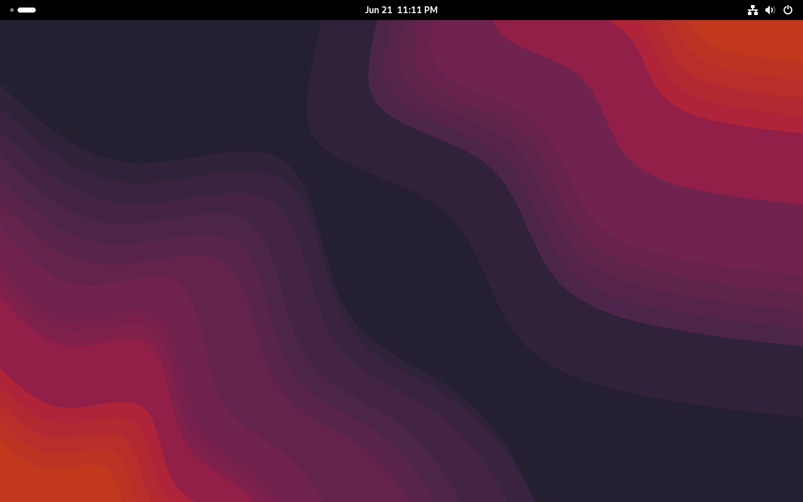

Система успешно загружается в графическое окружение и готова к работе — установка подтверждена как полностью работоспособная.

---

## Общий вывод

В ходе выполненных работ изучены и на практике опробованы базовые команды оболочки GNU/Linux для работы с файлами, каталогами, правами доступа, шаблонами, поиском и символическими ссылками (лаб. №34); разобран механизм восьмеричного назначения прав доступа на примере собственной группы (доп. задание 34_1); освоена работа с двухпанельным файловым менеджером Midnight Commander — навигация, просмотр дерева каталогов, информация об объектах, подсчёт занимаемого места (лаб. №35/36, частично). Дополнительно подтверждена корректность и работоспособность установленной операционной системы Debian GNU/Linux 13 (trixie) на виртуальной машине VirtualBox.