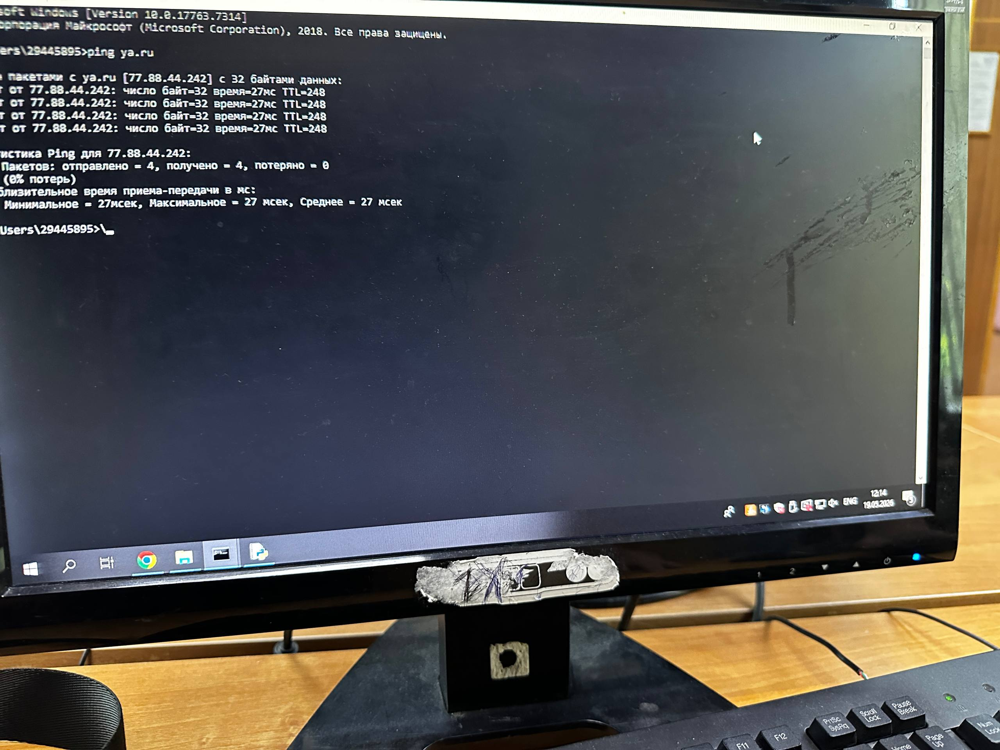

# 🖧 Лабораторная работа №2
### Подключение персонального компьютера к локальной вычислительной сети

| | |
|---|---|
| **Студент** | Абрамов Даниил Сергеевич |
| **Группа** | 28Ипо8481 |
| **Преподаватель** | Летунов Илья Анатольевич |

---

## 🎯 Цель работы

Получение практических навыков подключения ПК к локальной сети по технологии Ethernet: изучение сетевых адаптеров, монтаж кабеля UTP (витая пара) с разъёмами 8P8C, физическое подключение к коммутатору.

---

## 🛠️ Используемое оборудование

| Компонент | Описание |
|-----------|----------|
| **ПК** | AMD Ryzen 5 3600, 16 GB RAM |
| **ОС** | Windows 10 Pro 22H2, сборка 19045.4170 |
| **Сетевой адаптер** | Realtek PCIe GbE Family Controller (встроенный) |
| **Кабель** | UTP Cat 5e, 4 пары, длина 2 м |
| **Разъём** | 8P8C (RJ-45) |
| **Инструмент** | Кримпер HT-568R |

---

## 📖 Теоретическая часть

В сетях Ethernet для соединения узлов применяется кабель **витая пара** категории 5e и выше. Физически используется разъём **8P8C** (8 позиций, 8 контактов). В обиходе его называют RJ-45, хотя строго говоря RJ-45 — телефонный стандарт с иной конструкцией корпуса. В рамках данного отчёта термины используются как синонимы согласно общепринятой практике.

### 📑 Схема обжима T568B (прямой патч-корд)

| Контакт | Цвет жилы |
|:-------:|-----------|
| 1 | 🟧 Бело-оранжевый |
| 2 | 🟥 Оранжевый |
| 3 | 🟩 Бело-зелёный |
| 4 | 🟦 Синий |
| 5 | 🔵 Бело-синий |
| 6 | 🟢 Зелёный |
| 7 | 🟫 Бело-коричневый |
| 8 | 🟤 Коричневый |

---

## 🔬 Ход работы

### 1. Определение параметров сетевого адаптера

Параметры получены с помощью команды `ipconfig /all` и диспетчера устройств Windows.

**Операционная система:**

| Параметр | Значение |
|----------|----------|
| Издание | Windows 10 Pro |
| Версия | 22H2 |
| Сборка | 19045.4170 |

**Сетевой адаптер:**

| Параметр | Значение |
|----------|----------|
| Модель | Realtek PCIe GbE Family Controller |
| Интерфейс | PCI Express |
| MAC-адрес | `D4-5D-64-A2-1F-08` |
| Производитель (OUI) | Realtek Semiconductor |
| Скорости подключения | 10 / 100 / 1000 Мбит/с |

Вывод команды `getmac`:

```
Физический адрес    Имя транспорта
D4-5D-64-A2-1F-08   \Device\Tcpip_{GUID}
```

---

### 2. Монтаж патч-корда UTP Cat 5e

Цель — изготовить прямой кабель длиной 2 м для соединения ПК с коммутатором (технология 100Base-TX / 1000Base-T).

**Порядок действий:**

1. С помощью кримпера снята внешняя оболочка кабеля на длину около 13 мм. Изоляция с отдельных жил не снималась — разъём 8P8C использует технологию **IDC**, при которой контакт прорезает изоляцию самостоятельно в момент обжима.

2. Четыре пары раскручены и расположены в порядке T568B. Жилы выровнены и подрезаны до длины ~11 мм от края оболочки.

3. Пучок жил введён в коннектор (медные контакты смотрят от себя, защёлка снизу). Внешняя оболочка зашла внутрь корпуса для механической фиксации.

4. Коннектор обжат кримпером до щелчка. Второй конец кабеля обжат аналогично по той же схеме T568B.

---

### 3. Тестирование и подключение

**Проверка кабеля (LAN-тестером):**

```
Конец A → Конец B

1 → 1   ✅
2 → 2   ✅
3 → 3   ✅
4 → 4   ✅
5 → 5   ✅
6 → 6   ✅
7 → 7   ✅
8 → 8   ✅

Кабель исправен, короткого замыкания нет.
```

**Подключение к сети:**

Кабель подключён к порту сетевой карты ПК (MDI) и порту коммутатора TP-Link TL-SF1008D (MDIX). После подключения на коммутаторе загорелся индикатор **Link**. В Windows соединение определилось автоматически — скорость **1 Гбит/с**, дуплекс полный.

**Проверка доступа в Интернет — команда `ping ya.ru`:**



*Рис. 1. Отправлено 4 пакета, получено 4, потеряно 0 (0% потерь). Минимальное/максимальное/среднее время: 27 / 27 / 27 мс.*

---

## ❓ Контрольные вопросы

<details>
<summary><b>Q1. Кабели Ethernet. Что такое UTP, его плюсы и минусы?</b></summary>

В сетях Ethernet применяются три основных типа кабелей: коаксиальный (практически вышел из употребления), оптоволоконный и витая пара. UTP (Unshielded Twisted Pair) — неэкранированная витая пара. Скручивание пар снижает взаимные наводки между ними.

| | |
|---|---|
| ✅ **Достоинства** | Дешевизна, гибкость, лёгкость монтажа и ремонта |
| ❌ **Недостатки** | Уязвимость к внешним электромагнитным помехам, ограничение длины сегмента — 100 м |

</details>

<details>
<summary><b>Q2. MDI и MDIX. Когда нужен перекрёстный кабель?</b></summary>

- **MDI** — интерфейс конечного устройства (ПК): передача на контактах 1–2, приём на 3–6.
- **MDIX** — интерфейс коммутатора, у которого пары переставлены аппаратно.

Прямой кабель соединяет MDI с MDIX. **Перекрёстный (кроссовый) кабель** нужен при соединении двух устройств одного типа (ПК–ПК или коммутатор–коммутатор) без поддержки Auto-MDI/MDIX.

</details>

<details>
<summary><b>Q3. Зачем при монтаже не снимают изоляцию с жил?</b></summary>

Разъём 8P8C работает по технологии **IDC** (Insulation Displacement Connection). При обжиме острые лезвия контактов сами прорезают ПВХ-изоляцию и прижимаются к медной жиле. Это ускоряет монтаж и исключает риск повредить жилу при зачистке.

</details>

<details>
<summary><b>Q4. Нуль-модемный кабель в контексте Ethernet.</b></summary>

В терминологии Ethernet аналогом нуль-модемного кабеля является **кроссовый кабель** — он позволяет соединить два ПК напрямую, без коммутатора. В сетях до 100 Мбит/с достаточно задействовать 4 жилы (контакты 1, 2, 3, 6).

> ⚠️ Для гигабитных соединений (1000Base-T) необходимы все 8 жил, так как используются все четыре пары одновременно.

</details>

<details>
<summary><b>Q5. Идентификация адаптеров. Смена MAC-адреса.</b></summary>

Каждый сетевой адаптер имеет уникальный 48-битный MAC-адрес, назначенный производителем. Первые 24 бита — OUI-идентификатор производителя, оставшиеся 24 бита уникальны для конкретного устройства. MAC-адрес можно изменить программно.

Основные причины смены:
- Обход привязки услуг провайдера к оборудованию
- Тестирование защиты сети (ARP-спуфинг)
- Сохранение анонимности в публичных сетях

</details>

<details>
<summary><b>Q6. Конфигурирование сетевой платы.</b></summary>

Сетевая плата требует выделения аппаратных ресурсов:

| Ресурс | Назначение |
|--------|-----------|
| **I/O Port** | Адреса портов ввода-вывода для передачи данных между CPU и буфером карты |
| **IRQ** | Линия прерывания для оповещения процессора о поступлении пакета |

> В современных системах с поддержкой **Plug and Play** параметры назначаются автоматически операционной системой.

</details>

---

## 📝 Заключение

В ходе лабораторной работы был изучен процесс физического подключения ПК к локальной сети Ethernet:

- ✅ Изучены теоретические основы построения сетей Ethernet на физическом уровне
- ✅ Самостоятельно изготовлен патч-корд UTP Cat 5e длиной 2 м по схеме **T568B**
- ✅ Кабель проверен тестером — все 8 жил в норме, замыканий нет
- ✅ ПК успешно подключён к коммутатору, соединение установлено на **1 Гбит/с**
- ✅ Подтверждён доступ в Интернет командой `ping ya.ru` — потерь 0%, задержка 27 мс
- ✅ Определены характеристики адаптера **Realtek PCIe GbE**, включая MAC-адрес и его привязку к производителю **Realtek Semiconductor**

> **Цель лабораторной работы достигнута полностью.**

---

<div align="center">
<sub>Лабораторная работа №2 · Группа 28Ипо8481 · Абрамов Даниил Сергеевич</sub>
</div>