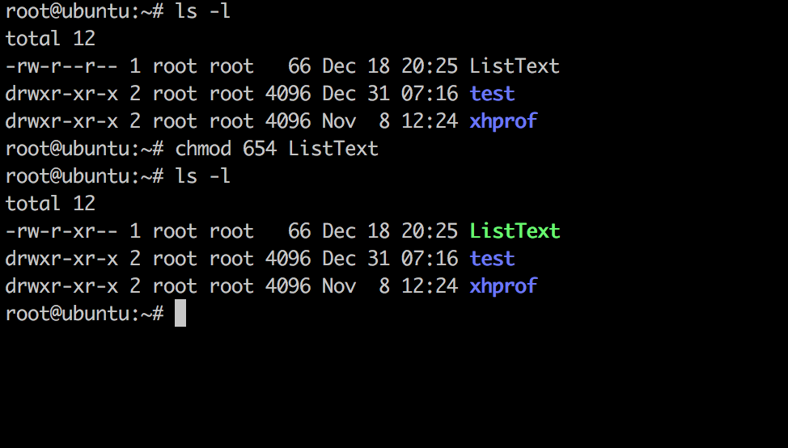
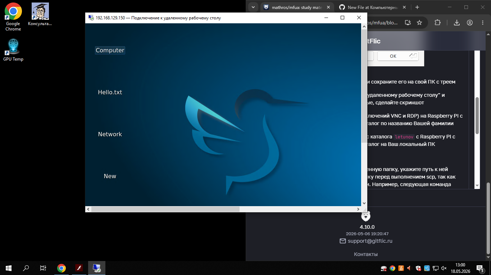

# Лабораторная работа: подключение к Raspberry Pi по протоколу SSH

| | |
|---|---|
| **Студент** | Абрамов Даниил Сергеевич |
| **Группа** | 28Ипо8481 |
| **Преподаватель** | Летунов Илья Анатольевич |

---

## Цель работы

Получение практических навыков удалённого подключения к одноплатному компьютеру Raspberry Pi по протоколу SSH, создание структуры каталогов, а также изучение механизма SSH-ключей.

---

## Часть 1. Подключение по SSH и создание каталогов

### 1.1. Подключение к Raspberry Pi

Для подключения к Raspberry Pi выполнена команда:

```bash
ssh user@192.168.129.150
```

После ввода пароля (`123`) получен доступ к консоли Raspberry Pi.

### 1.2. Создание каталога

В корневом каталоге находится папка по номеру группы. Внутри неё создан каталог с именем фамилии студента:

```bash
mkdir /28Ипо8481/abramov
```

### 1.3. Создание структуры файлов и каталогов

Согласно заданию, внутри созданного каталога сформирована структура вложенных папок и файлов. Для проверки структуры выполнена команда:

```bash
ls -R
```

**Скриншот выполнения команды `ls -R`:**




### 1.4. Подключение через удалённый рабочий стол (RDP)

Дополнительно выполнено подключение к Raspberry Pi через протокол RDP по адресу `192.168.129.150`. На рабочем столе видны созданные объекты.



*Рис. 1. Подключение к удалённому рабочему столу Raspberry Pi — видны папки и файлы на рабочем столе.*

### 1.5. Отключение

Для завершения SSH-сессии выполнена команда:

```bash
exit
```

---

## Часть 2. SSH-ключи

### 2.1. Проверка существующих ключей

Перед генерацией проверяется наличие существующих ключей:

```bash
ls ~/.ssh
```

Если в папке обнаружены файлы `id_rsa.pub` или `id_dsa.pub` — ключи уже существуют и генерацию можно пропустить.

### 2.2. Генерация SSH-ключей

```bash
ssh-keygen
```

После вызова команды предлагается указать путь для сохранения (по умолчанию `~/.ssh/` — нажать Enter) и опционально задать пароль для защиты приватного ключа.

После генерации в папке `~/.ssh/` появятся два файла:

| Файл | Описание |
|------|----------|
| `id_rsa` | Приватный (закрытый) ключ — хранится на ПК |
| `id_rsa.pub` | Публичный (открытый) ключ — копируется на Raspberry Pi |

### 2.3. Копирование публичного ключа на Raspberry Pi

Публичный ключ добавляется в файл `~/.ssh/authorized_keys` на Raspberry Pi командой:

```bash
ssh-copy-id user@192.168.129.150
```

После этого подключение к Raspberry Pi выполняется без ввода пароля:

```bash
ssh user@192.168.129.150
```

---

## Выводы

- ✅ Выполнено подключение к Raspberry Pi по протоколу SSH
- ✅ Создан каталог с именем студента в папке группы
- ✅ Сформирована структура каталогов согласно заданию
- ✅ Выполнено подключение через удалённый рабочий стол (RDP)
- ✅ Изучен механизм генерации и копирования SSH-ключей
- ✅ После настройки ключей вход осуществляется без пароля

---

<div align="center">
<sub>Лабораторная работа · Группа 28Ипо8481 · Абрамов Даниил Сергеевич</sub>
</div>