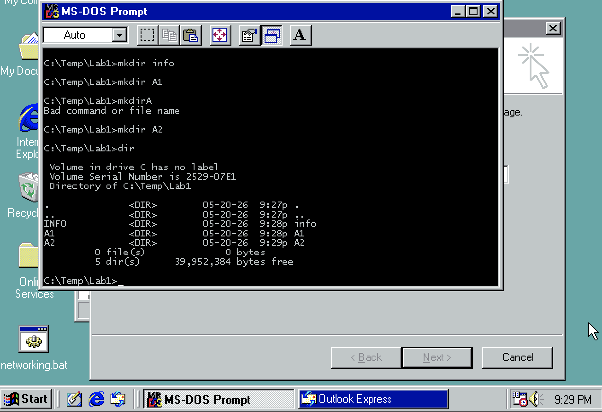

# 💻 Лабораторная работа №1: Командная строка Windows

| Поле | Значение |
|---|---|
| Студент | Абрамов Даниил Сергеевич |
| Группа | 28Ипо8481 |
| Преподаватель | Летунов Илья Анатольевич |
| Вариант | №1 (в строке приглашения вывести системную дату) |

---

## Цель работы

Развитие профессиональных навыков работы в командной строке Windows: создание и управление структурой каталогов, работа с файлами, настройка строки приглашения.

---

## Структура каталогов (Вариант №1)

```
Lab1
├── Info
│   ├── Personal
│   ├── University
│   └── Hobby
├── A1
├── A2
│   ├── B1
│   ├── B2
│   └── B3
└── A3
```

---

## Ход выполнения работы

### 1. Открыть командную строку

`Пуск → Программы → Стандартные → Командная строка`

---

### 2. Создать дерево каталогов в C:\Temp

```cmd
mkdir C:\Temp
cd C:\Temp
mkdir Lab1
cd Lab1
mkdir Info
mkdir A1
mkdir A2
dir
```

**Результат выполнения команд:**



*Рис. 1. Созданы каталоги INFO, A1, A2 в C:\Temp\Lab1 — команда `dir` подтверждает наличие всех папок.*

---

### 3. Создать подкаталоги внутри Info и A2

```cmd
cd Info
mkdir Personal
mkdir University
mkdir Hobby
cd ..
cd A2
mkdir B1
mkdir B2
mkdir B3
cd ..
```

---

### 4. Создать подкаталоги B4, B5 в A2 и удалить B2

```cmd
mkdir A2\B4
mkdir A2\B5
rd A2\B2
```

---

### 5. Создать файлы в каталоге Personal

```cmd
cd Info\Personal

copy con Name.txt
Абрамов Даниил Сергеевич
^Z

copy con Date.txt
Дата рождения: 01.01.2000
^Z

copy con School.txt
Школа №1
^Z

cd ..\..\
```

> `^Z` — нажать Ctrl+Z, затем Enter для завершения ввода

---

### 6. Создать файлы в каталоге University

```cmd
cd Info\University

copy con Name.txt
РТУ МИРЭА, специальность: Информационные системы и технологии
^Z

copy con Mark.txt
Математика: 85, Русский язык: 90, Информатика: 92. Сумма: 267
^Z

cd ..\..\
```

---

### 7. Создать файл в каталоге Hobby

```cmd
cd Info\Hobby

copy con hobby.txt
Программирование, сетевые технологии
^Z

cd ..\..\
```

---

### 8. Скопировать hobby.txt в A2 и переименовать

```cmd
copy Info\Hobby\hobby.txt A2\Lab_1.txt
```

---

### 9. Сделать копию Lab_1.txt и удалить оригинал

```cmd
cd A2
copy Lab_1.txt copy_Lab_1.txt
del Lab_1.txt
cd ..
```

---

### 10. Очистить экран

```cmd
cls
```

---

### 11. Вывести содержимое файлов каталога Personal

```cmd
type Info\Personal\Name.txt
type Info\Personal\Date.txt
type Info\Personal\School.txt
```

---

### 12. Отсортировать файлы каталога Personal по имени

```cmd
dir Info\Personal /ON
```

---

### 13. Объединить все файлы Personal в all.txt и вывести

```cmd
copy Info\Personal\Name.txt + Info\Personal\Date.txt + Info\Personal\School.txt Info\Personal\all.txt
type Info\Personal\all.txt
```

---

### 14. Отредактировать all.txt — добавить год рождения

```cmd
edit Info\Personal\all.txt
```

Добавить строку: `Год рождения: 2000`

Сохранить: `Alt → File → Save`, выйти: `Alt → File → Exit`

```cmd
type Info\Personal\all.txt
```

---

### 15. Скопировать all.txt в директорию A1

```cmd
copy Info\Personal\all.txt A1\all.txt
```

---

### 16. Удалить все директории, содержащие «A» или «2»

```cmd
rd A1
rd A2\B1
rd A2\B3
rd A2\B4
rd A2\B5
rd A2
rd A3
```

---

### 17. Изменить строку приглашения (Вариант №1 — системная дата)

```cmd
prompt $D$G
```

Результат: строка приглашения принимает вид `20.05.2026>`

Для возврата к стандартному виду:

```cmd
prompt $P$G
```

---

## Справочник команд

| Команда | Назначение |
|---|---|
| `copy con <файл>` | Создать файл с вводом из консоли (завершение — Ctrl+Z) |
| `del <файл>` | Удалить файл |
| `ren <файл1> <файл2>` | Переименовать файл |
| `edit <файл>` | Редактировать файл |
| `cd <путь>` | Перейти в каталог |
| `dir /ON` | Вывод содержимого каталога, сортировка по имени |
| `md / mkdir <каталог>` | Создать каталог |
| `rd <каталог>` | Удалить каталог |
| `cls` | Очистить экран |
| `type <файл>` | Вывести содержимое файла |
| `copy <откуда> <куда>` | Копировать файл |
| `prompt` | Изменить строку приглашения |

### Параметры команды `prompt`

| Код | Значение |
|---|---|
| `$D` | Системная дата |
| `$T` | Системное время |
| `$P` | Текущий каталог |
| `$N` | Текущий диск |
| `$V` | Версия системы |
| `$G` | Символ `>` |
| `$L` | Символ `<` |

---

## Ответы на контрольные вопросы

<details>
<summary><b>1. Что такое командная строка?</b></summary>

Командная строка (CLI, Command Line Interface) — текстовый интерфейс взаимодействия пользователя с операционной системой. В Windows реализована через интерпретатор `cmd.exe`, который принимает команды в текстовом виде и выполняет их.

</details>

<details>
<summary><b>2. Основные команды управления файлами</b></summary>

| Команда | Действие |
|---|---|
| `copy` | Копирование файла |
| `del` | Удаление файла |
| `ren` | Переименование файла |
| `move` | Перемещение файла |
| `type` | Вывод содержимого файла |
| `edit` | Редактирование файла |

</details>

<details>
<summary><b>3. Команды вывода информации о системе</b></summary>

| Команда | Что выводит |
|---|---|
| `ver` | Версия ОС |
| `date` | Системная дата |
| `time` | Системное время |
| `systeminfo` | Подробная информация о системе |
| `hostname` | Имя компьютера |
| `ipconfig` | Сетевые параметры |

</details>

<details>
<summary><b>4. Команды ввода/вывода файлов</b></summary>

| Команда | Назначение |
|---|---|
| `type <файл>` | Вывод содержимого файла на экран |
| `copy con <файл>` | Ввод данных в файл с клавиатуры |
| `copy <f1>+<f2> <f3>` | Объединение файлов |
| `more <файл>` | Постраничный вывод |
| `>` | Перенаправление вывода в файл (перезапись) |
| `>>` | Перенаправление вывода в файл (добавление) |

</details>

<details>
<summary><b>5. Возможно ли полноценное управление системой через CMD?</b></summary>

В основном — да. Через командную строку Windows можно управлять файловой системой, сетью (`ipconfig`, `ping`, `netstat`), процессами (`tasklist`, `taskkill`), службами (`sc`, `net`), реестром (`reg`) и многим другим. Однако некоторые задачи удобнее выполнять через графическую оболочку.

</details>

<details>
<summary><b>6. Чем CMD Windows отличается от MS-DOS?</b></summary>

- CMD работает поверх Windows NT-ядра, MS-DOS — самостоятельная ОС
- CMD поддерживает длинные имена файлов с пробелами, MS-DOS — только формат 8.3
- CMD работает в многозадачной среде, MS-DOS — однозадачная система
- В CMD доступны расширенные переменные среды и скрипты `.bat`
- PowerShell полностью заменяет CMD в современных системах Windows

</details>

<details>
<summary><b>7. Примеры интерпретаторов команд в других ОС</b></summary>

| ОС | Интерпретатор |
|---|---|
| Linux / macOS | `bash` (Bourne Again Shell) |
| Linux | `zsh`, `fish`, `sh` |
| macOS | `zsh` (по умолчанию с macOS Catalina) |
| Windows | `cmd.exe`, `PowerShell` |
| FreeBSD | `tcsh`, `bash` |

</details>

---

## Вывод

- ✅ Создана структура каталогов по Варианту №1 в `C:\Temp\Lab1`
- ✅ Созданы каталоги INFO, A1, A2 — подтверждено командой `dir`
- ✅ В каталоге A2 созданы подкаталоги B4 и B5, удалён B2
- ✅ Созданы файлы в Personal, University и Hobby с нужным содержимым
- ✅ Выполнено копирование, переименование и удаление файлов
- ✅ Содержимое каталога Personal объединено в `all.txt` и отредактировано
- ✅ Удалены каталоги, содержащие букву «A» или цифру «2»
- ✅ Строка приглашения изменена на вывод системной даты (`prompt $D$G`)

---

<sub>Лабораторная работа №1 · Командная строка Windows · Группа 28Ипо8481 · Абрамов Даниил Сергеевич</sub>