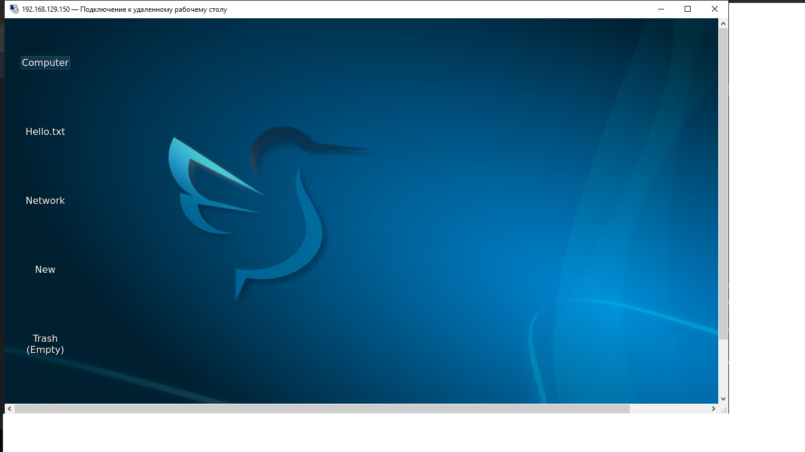
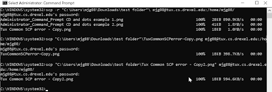

# Лабораторная работа: подключение к Raspberry Pi по протоколу VNC

| | |
|---|---|
| **Студент** | Абрамов Даниил Сергеевич |
| **Группа** | 28Ипо8481 |
| **Преподаватель** | Летунов Илья Анатольевич |

---

## Цель работы

Получение практических навыков удалённого подключения к Raspberry Pi через протоколы VNC и RDP, а также работа с утилитой `scp` для копирования файлов между компьютером и сервером.

---

## Часть 1. Подключение по VNC (TigerVNC)

### 1.1. Установка TigerVNC

Скачан и установлен клиент [TigerVNC](https://github.com/TigerVNC/tigervnc/releases) с официальной страницы релизов на GitHub.

### 1.2. Подключение к Raspberry Pi

В поле «VNC-сервер» введён IP-адрес:

```
192.168.129.150
```

В настройках (вкладка «Ввод») активирована опция «Показывать точку при отсутствии курсора».

При появлении предупреждения безопасности нажата кнопка «Да».

### 1.3. Аутентификация

| Поле | Значение |
|------|----------|
| Имя пользователя | `user` |
| Пароль | `123` |

---

## Часть 2. Подключение по RDP

Запущена утилита «Подключение к удалённому рабочему столу», введён адрес `192.168.129.150` и аутентификационные данные.

**Скриншот рабочего стола Raspberry Pi через RDP:**



*Рис. 1. Рабочий стол Raspberry Pi через протокол RDP — адрес 192.168.129.150, видны файлы на рабочем столе.*

---

## Часть 3. Работа с SCP

### 3.1. Копирование скриншотов на Raspberry Pi

Скриншоты подключений VNC и RDP скопированы в каталог с именем студента на Raspberry Pi:

```bash
scp rdp_screen.png user@192.168.129.150:/home/user/abramov/
scp vnc_screen.png user@192.168.129.150:/home/user/abramov/
```

### 3.2. Копирование файла варианта с Raspberry Pi

Файл варианта скопирован из каталога `letunov` на локальный компьютер:

```bash
scp user@192.168.129.150:/home/user/letunov/variant_abramov.txt ./
```

**Скриншот выполнения команд SCP:**



*Рис. 2. Копирование файлов между локальным ПК и Raspberry Pi с помощью команды `scp`.*

---

## Справка по командам SCP

### Загрузка файла на сервер (upload)

```bash
scp file.txt user@192.168.129.150:/path/to/dest/
```

### Скачивание файла с сервера (download)

```bash
scp user@192.168.129.150:/path/to/file.txt ./local-dir/
```

### Синтаксис

```
scp [опции] источник назначение
```

---

## Выводы

- ✅ Выполнено подключение к Raspberry Pi по протоколу VNC через TigerVNC
- ✅ Выполнено подключение по RDP, сделан скриншот рабочего стола
- ✅ Скриншоты скопированы на Raspberry Pi в каталог `abramov` командой `scp`
- ✅ Файл варианта скопирован с Raspberry Pi на локальный ПК

---

<div align="center">
<sub>Лабораторная работа · VNC/RDP · Группа 28Ипо8481 · Абрамов Даниил Сергеевич</sub>
</div>